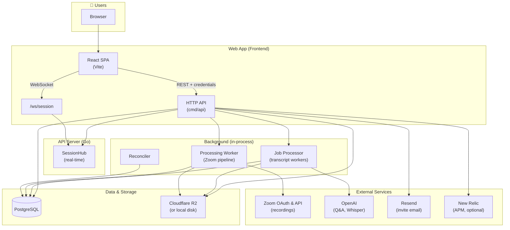

# TalkBack — Architecture Overview

High-level view of main tech stacks, services, and applications. The product is evolving toward **decision-centric sessions** (premise, primary decision, outcomes) and decision intelligence, not only generic meeting summaries or Q&A.

## Diagram

## Tech stacks

| Layer | Technology | Purpose |
|-------|------------|--------|
| **Frontend** | React 18, Vite 5 | SPA: sessions, materials, Q&A, invite flow, creator/participant modes |
| **API** | Go (stdlib `net/http`) | REST API, cookie + Bearer auth; optional CORS for split-origin; single binary `cmd/api` |
| **Real-time** | WebSocket (gorilla/websocket), SessionHub | Live updates: questions, answers, processing ready, invitation accepted |
| **Database** | PostgreSQL 16 | Users, sessions, materials, invitations, questions/answers, jobs (golang-migrate) |
| **Object storage** | Cloudflare R2 (or local disk) | Video files, uploads, presigned PUT/GET; optional `STORAGE_DRIVER=r2` |
| **Transcription** | OpenAI Whisper (via utils) | Transcript jobs; job processor runs in API process with configurable workers |
| **Q&A** | OpenAI API | RAG answers over session content (internal/rag) |
| **Video pipeline** | Unified flow (see below) | Two inputs: (1) Provider import: get video + native transcript or Whisper fallback; (2) User upload: Whisper on file. Both emit video + transcript. Extensible to Loom, Google Meet, Teams. |
| **Zoom** | Zoom OAuth 2.0 + Cloud Recording API | Provider import: download MP4, prefer Zoom VTT transcript; Whisper fallback when transcript missing (planned). |
| **Email** | Resend (optional) or mailto | Invitation emails; `RESEND_API_KEY` for sending |
| **APM** | New Relic (optional) | Wrapped routes and custom attributes when keys set |

## Applications & processes

| App / process | Location | Role |
|---------------|----------|------|
| **Web UI** | `web/` | React app; dev: Vite (e.g. 3000), prod: static build served by same or separate host |
| **API server** | `cmd/api` | HTTP + WebSocket, migrations, job processor, Zoom worker, reconciler |
| **Job processor** | `internal/utils/job_processor.go` | Polls transcript jobs, runs Whisper (or STT), then triggers RAG index |
| **Processing worker** | `internal/processing/` | Zoom import pipeline: fetch MP4, ingest, optional transcript; broadcasts when ready |
| **Reconciler** | `internal/processing/` | Periodic reconciliation of session/processing state |

## Video & transcript pipeline (unified flow)

There is a **single conceptual flow** for video: two input mechanisms, one outcome. In every case the system should **emit a video file with a transcript linked to it** so the session has a canonical “video + transcript” for playback and Q&A.

### Two input mechanisms, one outcome

| Input | How video is obtained | How transcript is obtained | Outcome |
|-------|------------------------|-----------------------------|---------|
| **Provider import** | System downloads the recording from the provider (Zoom today; future: Loom, Google Meet, Teams). | Prefer **native transcript** from the provider; if unavailable or not ready → **Whisper** on the downloaded video. | Video file + transcript linked (e.g. `video_sources` + transcript). |
| **User upload** | User uploads an MP4 (or other video) directly. | **Whisper** on the stored file. | Same: video file + transcript linked. |

So there are effectively **three runtime cases**, all emitting the same artifact:

1. **Zoom (or future provider) with native transcript** — Download video → download transcript from provider → link both.
2. **Zoom (or future provider) without transcript** — Download video → run **Whisper** on the stored file → link transcript to that video.
3. **User upload (MP4)** — Store uploaded file → run **Whisper** → link transcript to that video.

The architecture is built so that **any new provider** (Loom, Google Meet, Microsoft Teams) follows the same path as Zoom: try video + native transcript first; if transcript is missing or not ready, run Whisper on the stored video. No extra product behavior is required beyond implementing that contract.

### Provider path (Zoom today; extensible)

For provider-based imports (Zoom now; Loom / Google / Teams later), the flow is:

1. **Resolve & download video** — Use provider API to get the recording and download the video file (e.g. MP4). Store it (R2 or local) and associate it with the session (e.g. `file_artifacts`, `session.primary_video_artifact_id`).
2. **Resolve transcript** — Try to get a **native transcript** from the provider (e.g. Zoom VTT, future Loom/Google/Teams captions). If available and ready, download and parse it.
3. **Fallback: Whisper** — If the provider does not offer a transcript or it is not ready, run **Whisper** on the stored video file and use that as the transcript.
4. **Emit** — Persist the video file reference and the transcript (with segments if available), linked to the session via `video_sources` (and related tables). The session then has one video + transcript pair.

New providers plug in by implementing this contract; the rest of the app (playback, Q&A, RAG) stays provider-agnostic.

### Upload path

1. User uploads an MP4 (or other supported video) as the **session video** (not as a “material” in the materials list).
2. Store the file (local or R2) and create a **video source** for it.
3. Enqueue a **transcript job**; the job processor runs **Whisper** on the stored file.
4. On completion, save the transcript on that video source. Result: same as provider path — video file with transcript linked.

### Extensibility (Loom, Google Meet, Teams)

The pipeline is designed so that **Loom, Google Meet, Microsoft Teams** (and similar) can be added as additional **provider** sources without changing the overall flow:

- Each new provider implements: (1) resolve recording URL, (2) download video, (3) try to fetch native transcript/captions, (4) if no transcript → enqueue Whisper job on the stored video, (5) write transcript (native or Whisper) onto the same video entity.
- The rest of the stack (job processor for Whisper, `video_sources`, RAG, playback) is shared. No need to implement these providers now; the architecture is intended to support them when needed.

### Current implementation notes

- **Zoom**: Processing pipeline (`internal/processing/pipeline.go`) downloads the Zoom MP4, stores it as a `file_artifact`, sets `session.primary_video_artifact_id`, then tries Zoom transcript (VTT). If the transcript is not available or still processing: when the video is stored **locally** and the job processor is set, the pipeline creates a `video_source` (pending), enqueues a **Whisper** transcript job on the stored file, and sets the processing job to `awaiting_whisper`; when the transcript job completes, the job processor marks the processing job ready and triggers RAG index + broadcast. When the video is in **R2**, the job continues to wait for Zoom transcript (Whisper fallback for R2 can be added later).
- **Upload (session video)**: `video_upload` creates a `video_source` with the stored file, enqueues a transcript job; Whisper writes the transcript onto that video source. This matches the unified “video + transcript” outcome.
- **Materials (MP4 in materials list)**: Uploaded video files in the **materials** list are transcribed via Whisper and stored as `material.extracted_text` (separate from the primary session video). They are not yet represented as a first-class “video + transcript” pair in the same way as the session video; alignment with the common flow can be a later step if desired.

---

## Key internal packages

- **internal/handlers** — HTTP and WebSocket handlers (sessions, auth, invitations, Zoom, etc.)
- **internal/database** — PostgreSQL access (sessions, users, materials, invitations, questions)
- **internal/auth** — Cookie + accept-token auth, password hashing
- **internal/invitations** — Invite create/resolve/accept/resend/revoke, tokens
- **internal/processing** — Zoom pipeline, worker, reconciler (provider-import path)
- **internal/rag** — Indexing and Q&A over session content
- **internal/storage** — Upload root; **internal/storage/r2** — R2 client and presigning
- **internal/email** — Resend sender for invite emails
- **internal/utils** — Job processor, Whisper transcriber, Zoom client, Loom resolver

## MCP Phase 4 — cross-session intelligence

Agents using **`talkback-mcp`** can call cross-session tools (e.g. **`search_all_sessions`**, **`get_decisions_by_topic`**) that enforce the same **per-user session visibility** as the web app. The MVP **does not** introduce a separate search cluster: vector search reuses **`session_chunks`** embeddings; decision-topic search queries **`sessions`** decision fields. See **[`docs/cross-session-intelligence.md`](cross-session-intelligence.md)** (SCRUM-65).

## Product direction

Sessions are evolving to support **premise** and **primary decision** (schema and UX). The long-term goal includes **decision intelligence**: structured decisions and outcomes derived from or attached to sessions. Naming should stay clear (e.g. decision topic vs decision outcome) as these concepts are added.

---

## Deployment (e.g. Render)

- **Unified web service (typical)**: single Render service runs `cmd/api` with embedded SPA; same origin for browser + API — no CORS allowlist required for first-party use. `APP_BASE_URL` is the public app URL for invite links.
- **Split-origin (legacy / advanced)**: separate static site + API host — set `CORS_ALLOWED_ORIGINS` / `TB_ALLOWED_ORIGINS` as documented.
- **PostgreSQL**: managed Postgres; same DB used by API (migrations on startup when `RUN_MIGRATIONS=true`).
