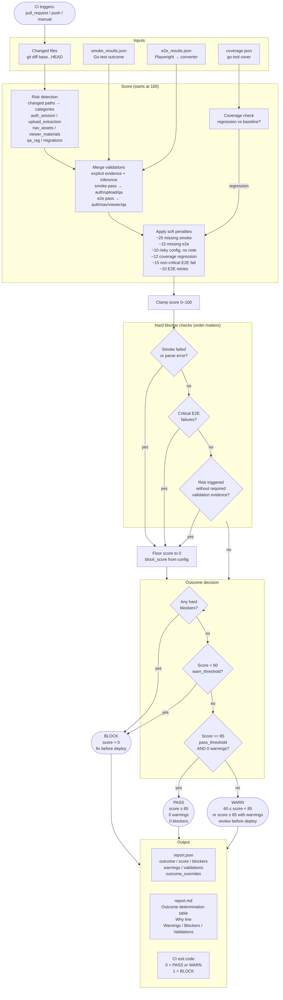

# Release Readiness — Decision Flow



## Key rules

| Rule | Type | Effect on score | Effect on outcome |
|------|------|-----------------|-------------------|
| Smoke failed | Hard blocker | floor to 0 | BLOCK |
| Critical E2E failure | Hard blocker | floor to 0 | BLOCK |
| Risk path changed, validation missing | Hard blocker | floor to 0 | BLOCK |
| Score < warn_threshold (60) | Score gate | — | BLOCK |
| Score >= pass_threshold (85) AND warnings present | Soft override | — | WARN (not PASS) |
| Non-critical E2E failure | Soft penalty | −15 | contributes to WARN |
| E2E retries | Soft penalty | −10 | contributes to WARN |
| Coverage regression | Soft penalty | −12 | contributes to WARN |
| Risky config change, no validation note | Soft penalty | −10 | contributes to WARN |

## PASS requires both conditions

```
score >= 85  AND  warnings == 0
```

Score alone is not sufficient. A score of 85/100 with any warning produces **WARN**, not PASS.
The `outcome_overrides` field in the JSON names this explicitly when it occurs.
